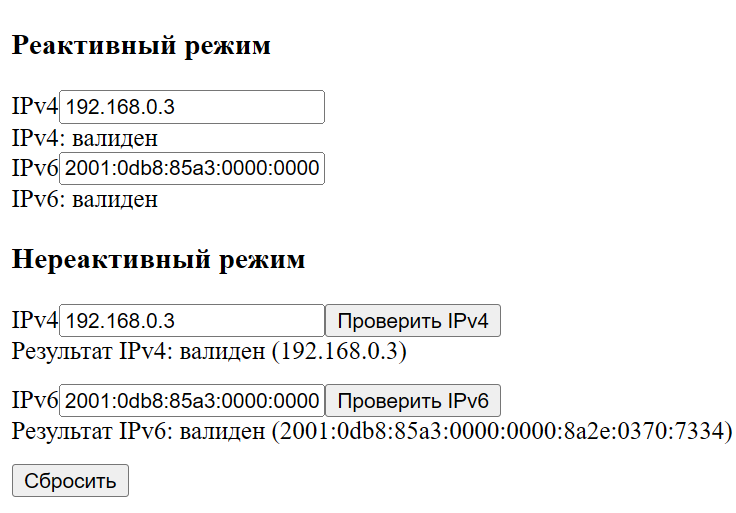
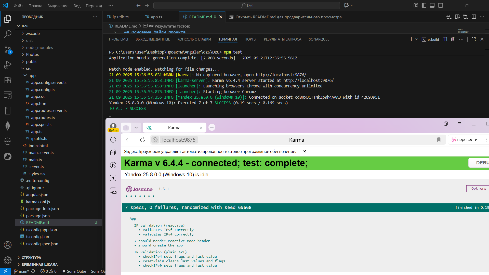

Привет всем кто читает этот отчет. 

Проект прост, как понятно из названия это IP4 и IP6 Validator на фреймворке ангулар. 

## Основные файлы проекта

### app.ts
```typescript
import { Component } from '@angular/core';
import { FormsModule } from '@angular/forms';
import { isIPv4 as utilIsIPv4, isIPv6 as utilIsIPv6 } from './ip.utils';

@Component({
  selector: 'app-root',
  imports: [FormsModule],
  templateUrl: './app.html',
  styleUrl: './app.css'
})

export class App {
  reactiveIPv4Value: string = '';
  reactiveIPv6Value: string = '';

  lastCheckedIPv4Value = '';
  lastCheckedIPv6Value = '';
  isPlainIPv4Valid: boolean | null = null;
  isPlainIPv6Valid: boolean | null = null;

  get isReactiveIPv4Valid(): boolean {
    return this.isIPv4(this.reactiveIPv4Value.trim());
  }
  get isReactiveIPv6Valid(): boolean {
    return this.isIPv6(this.reactiveIPv6Value.trim());
  }

  checkIPv4(value: string): void {
    const v = (value ?? '').trim();
    this.lastCheckedIPv4Value = v;
    this.isPlainIPv4Valid = this.isIPv4(v);
  }
  checkIPv6(value: string): void {
    const v = (value ?? '').trim();
    this.lastCheckedIPv6Value = v;
    this.isPlainIPv6Valid = this.isIPv6(v);
  }
  resetPlain(): void {
    this.lastCheckedIPv4Value = '';
    this.lastCheckedIPv6Value = '';
    this.isPlainIPv4Valid = null;
    this.isPlainIPv6Valid = null;
  }

  private isIPv4(input: string): boolean {
    return utilIsIPv4(input);
  }

  private isIPv6(input: string): boolean {
    return utilIsIPv6(input);
  }
}

```

Главный компонент приложения, содержащий логику валидации IP-адресов. Реализует два режима работы:
- **Реактивный режим**: автоматическая валидация при вводе через геттеры `isReactiveIPv4Valid` и `isReactiveIPv6Valid`
- **Нереактивный режим**: ручная проверка через методы `checkIPv4()` и `checkIPv6()` с кнопками

Компонент использует утилиты из `ip.utils.ts` для валидации и поддерживает сброс состояния через `resetPlain()`.

### ip.utils.ts
```typescript
const ipv4Part = '(?:25[0-5]|2[0-4]\\d|1\\d{2}|[1-9]?\\d)';
const ipv4FourOctet = new RegExp(`^${ipv4Part}\\.${ipv4Part}\\.${ipv4Part}\\.${ipv4Part}$`);

const ipv6Part = '(?:[0-9a-f]+::?)+';
const ipv6Native = new RegExp(`^(::)?(${ipv6Part})?([0-9a-f]+)?(::)?$`, 'i');
const ipv6Transitional = new RegExp(`^((?:${ipv6Part})|(?:::)(?:${ipv6Part})?)${ipv4Part}\\.${ipv4Part}\\.${ipv4Part}\\.${ipv4Part}$`, 'i');

export function isIPv4(input: string): boolean {
  if (!input) return false;
  return ipv4FourOctet.test(input);
}

export function isIPv6(input: string): boolean {
  if (!input.includes(':')) return false;
  return ipv6Native.test(input) || ipv6Transitional.test(input);
}
````

Утилитарный модуль с функциями валидации IP-адресов:
- `isIPv4()`: проверка IPv4 адресов с использованием регулярного выражения для октетов (0-255)
- `isIPv6()`: проверка IPv6 адресов, включая нативные и переходные форматы (с встроенными IPv4)

Использует строгие регулярные выражения для точной валидации форматов адресов. 

Источник: https://stackoverflow.com/questions/9208814/validate-ipv4-ipv6-and-hostname

### app.html

```html
<h3>Реактивный режим</h3>
<div>
  <label for="reactive-ipv4">IPv4</label>
  <input id="reactive-ipv4" type="text" [(ngModel)]="reactiveIPv4Value">
</div>
<div>IPv4: {{ isReactiveIPv4Valid ? 'валиден' : 'невалиден' }}</div>

<div>
  <label for="reactive-ipv6">IPv6</label>
  <input id="reactive-ipv6" type="text" [(ngModel)]="reactiveIPv6Value">
</div>
<div>IPv6: {{ isReactiveIPv6Valid ? 'валиден' : 'невалиден' }}</div>

<h3>Нереактивный режим</h3>
<div style="margin-bottom: 12px;">
  <label for="plain-ipv4">IPv4</label>
  <input #plainV4 id="plain-ipv4" type="text">
  <button type="button" (click)="checkIPv4(plainV4.value)">Проверить IPv4</button>
  @if (isPlainIPv4Valid !== null) {
    <div>Результат IPv4: {{ isPlainIPv4Valid ? 'валиден' : 'невалиден' }} ({{ lastCheckedIPv4Value }})</div>
  }
</div>

<div style="margin-bottom: 12px;">
  <label for="plain-ipv6">IPv6</label>
  <input #plainV6 id="plain-ipv6" type="text">
  <button type="button" (click)="checkIPv6(plainV6.value)">Проверить IPv6</button>
  @if (isPlainIPv6Valid !== null) {
    <div>Результат IPv6: {{ isPlainIPv6Valid ? 'валиден' : 'невалиден' }} ({{ lastCheckedIPv6Value }})</div>
  }
</div>

<button type="button" (click)="resetPlain()">Сбросить</button>
```

Шаблон пользовательского интерфейса с двумя секциями:
- **Реактивный режим**: поля ввода с двусторонней привязкой данных `[(ngModel)]` и автоматическим отображением результата
- **Нереактивный режим**: поля ввода с кнопками проверки и условным отображением результатов через `@if`

 

### app.spec.ts
```typescript
import { TestBed } from '@angular/core/testing';
import { App } from './app';

describe('App', () => {
  beforeEach(async () => {
    await TestBed.configureTestingModule({
      imports: [App],
    }).compileComponents();
  });

  it('should create the app', () => {
    const fixture = TestBed.createComponent(App);
    const app = fixture.componentInstance;
    expect(app).toBeTruthy();
  });

  it('should render reactive mode header', () => {
    const fixture = TestBed.createComponent(App);
    fixture.detectChanges();
    const compiled = fixture.nativeElement as HTMLElement;
    expect(compiled.querySelector('h3')?.textContent).toContain('Реактивный режим');
  });

  describe('IP validation (reactive)', () => {
    it('validates IPv4 correctly', () => {
      const fixture = TestBed.createComponent(App);
      const app = fixture.componentInstance;

      app.reactiveIPv4Value = '127.0.0.1';
      expect(app.isReactiveIPv4Valid).toBeTrue();

      app.reactiveIPv4Value = '255.255.255.255';
      expect(app.isReactiveIPv4Valid).toBeTrue();

      app.reactiveIPv4Value = '0.0.0.0';
      expect(app.isReactiveIPv4Valid).toBeTrue();

      app.reactiveIPv4Value = '256.0.0.1';
      expect(app.isReactiveIPv4Valid).toBeFalse();

      app.reactiveIPv4Value = '1.2.3';
      expect(app.isReactiveIPv4Valid).toBeFalse();

      app.reactiveIPv4Value = '01.2.3.4';
      expect(app.isReactiveIPv4Valid).toBeFalse();
    });

    it('validates IPv6 correctly', () => {
      const fixture = TestBed.createComponent(App);
      const app = fixture.componentInstance;

      app.reactiveIPv6Value = '::';
      expect(app.isReactiveIPv6Valid).toBeTrue();

      app.reactiveIPv6Value = '::1';
      expect(app.isReactiveIPv6Valid).toBeTrue();

      app.reactiveIPv6Value = '2001:db8::1';
      expect(app.isReactiveIPv6Valid).toBeTrue();

      app.reactiveIPv6Value = '::ffff:192.168.0.1';
      expect(app.isReactiveIPv6Valid).toBeTrue();

      app.reactiveIPv6Value = '1';
      expect(app.isReactiveIPv6Valid).toBeFalse();

      app.reactiveIPv6Value = 'gggg::1';
      expect(app.isReactiveIPv6Valid).toBeFalse();
    });
  });

  describe('IP validation (plain API)', () => {
    it('checkIPv4 sets flags and last value', () => {
      const fixture = TestBed.createComponent(App);
      const app = fixture.componentInstance;

      app.checkIPv4('192.168.1.10');
      expect(app.isPlainIPv4Valid).toBeTrue();
      expect(app.lastCheckedIPv4Value).toBe('192.168.1.10');

      app.checkIPv4('192.168.1');
      expect(app.isPlainIPv4Valid).toBeFalse();
      expect(app.lastCheckedIPv4Value).toBe('192.168.1');
    });

    it('checkIPv6 sets flags and last value', () => {
      const fixture = TestBed.createComponent(App);
      const app = fixture.componentInstance;

      app.checkIPv6('::1');
      expect(app.isPlainIPv6Valid).toBeTrue();
      expect(app.lastCheckedIPv6Value).toBe('::1');

      app.checkIPv6('1');
      expect(app.isPlainIPv6Valid).toBeFalse();
      expect(app.lastCheckedIPv6Value).toBe('1');
    });

    it('resetPlain clears last values and flags', () => {
      const fixture = TestBed.createComponent(App);
      const app = fixture.componentInstance;

      app.checkIPv4('127.0.0.1');
      app.checkIPv6('::1');
      app.resetPlain();

      expect(app.lastCheckedIPv4Value).toBe('');
      expect(app.lastCheckedIPv6Value).toBe('');
      expect(app.isPlainIPv4Valid).toBeNull();
      expect(app.isPlainIPv6Valid).toBeNull();
    });
  });
});
```

Тесты сгенеренные через ИИ для проверки валидации Реактивного и Нереактивного режима:
- **Базовые тесты**: создание компонента и рендеринг заголовков
- **Реактивная валидация**: тестирование геттеров для IPv4 и IPv6 с различными валидными и невалидными адресами
- **Нереактивная валидация**: проверка методов `checkIPv4()`, `checkIPv6()` и `resetPlain()`
- **Покрытие**: тестирует граничные случаи, включая пустые строки, неверные форматы и специальные IPv6 адреса

## Результаты тестов:

Из-за того что у меня не стоит Chrome, а также не прям сильно разобрался в тестах в Ангулар, то занейросетил и по итогу перевел работу тестов на Yandex. Файл karma для этого пришлось настроить так как в Ангуляре настроен вроде жтот инструмент для тестов и пришлось добавлять конфиг. 

Для тестинга через Yandex browser как это было в моем случае обязательно нужно выполнить следующие команды:

1- $env:CHROME_BIN = "C:\Users\user\AppData\Local\Yandex\YandexBrowser\Application\browser.exe"
2 - npm test




